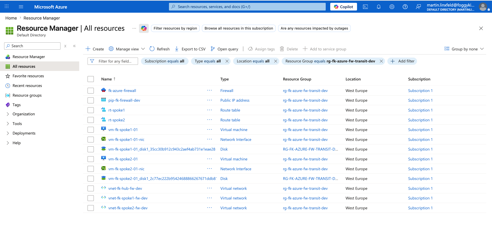
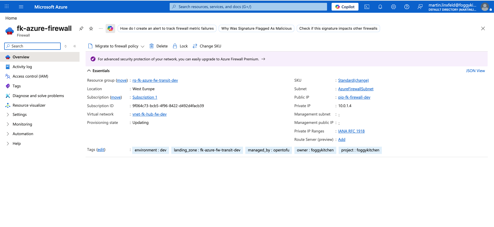
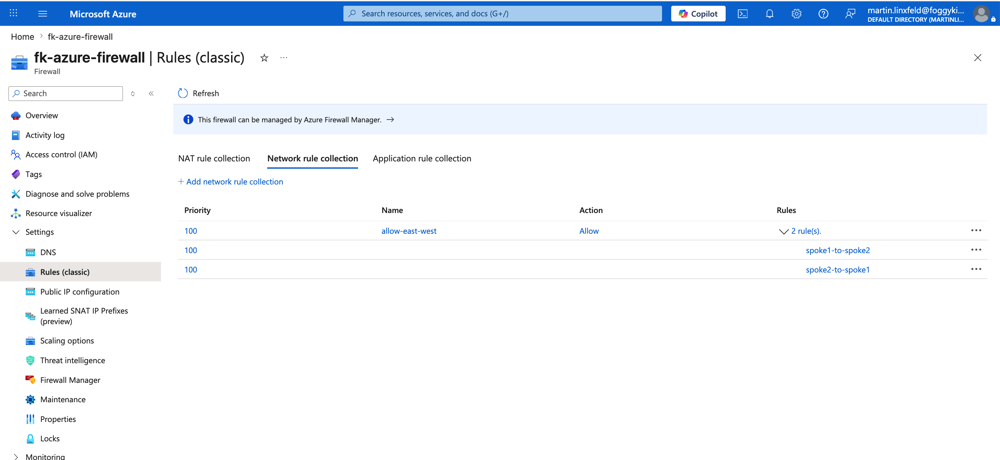
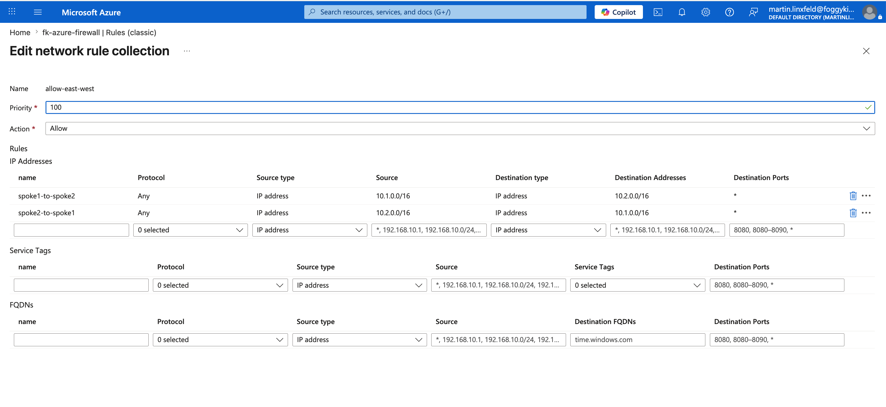
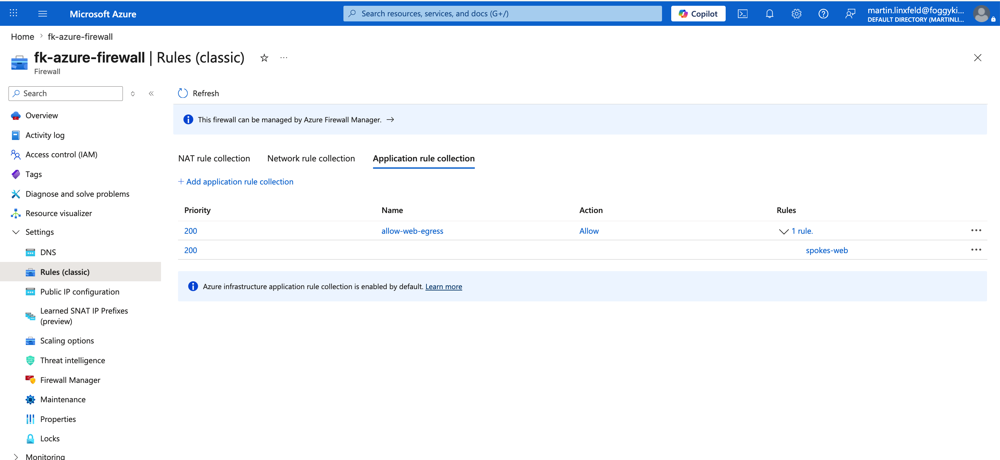
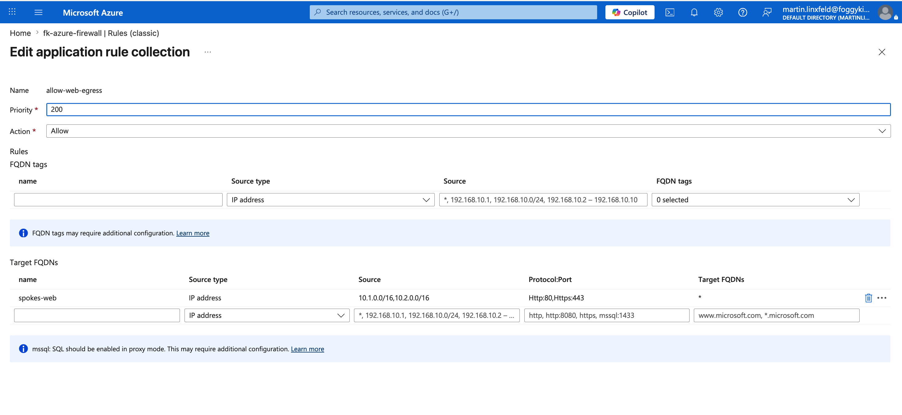
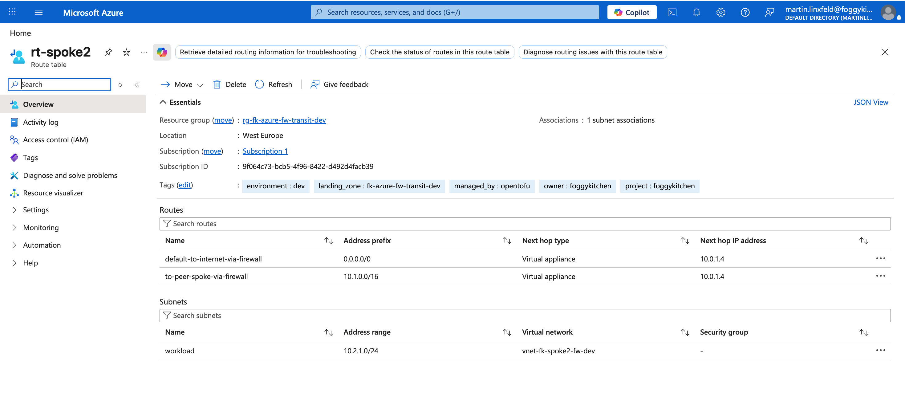
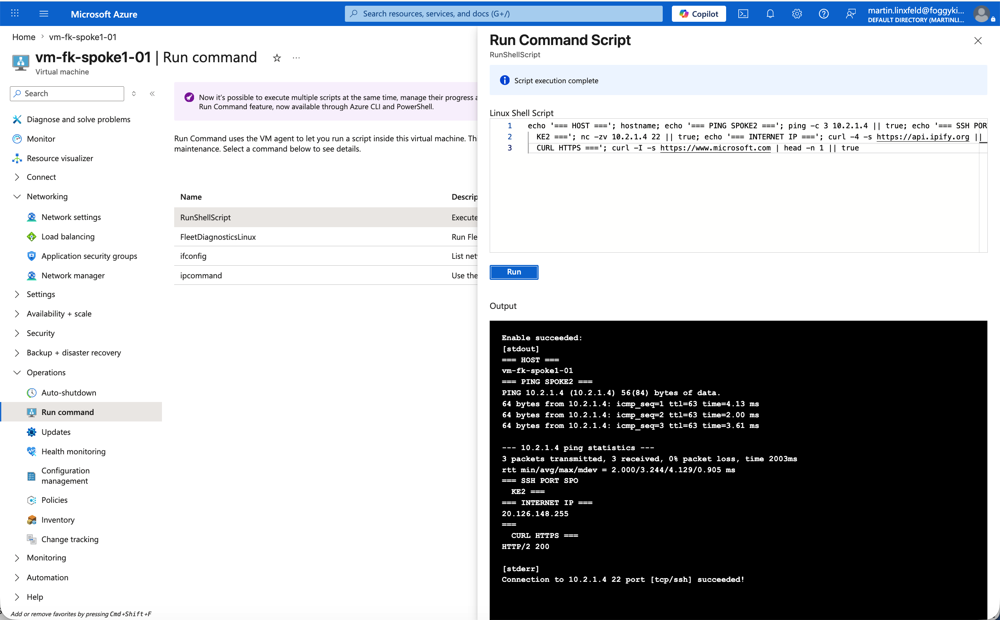
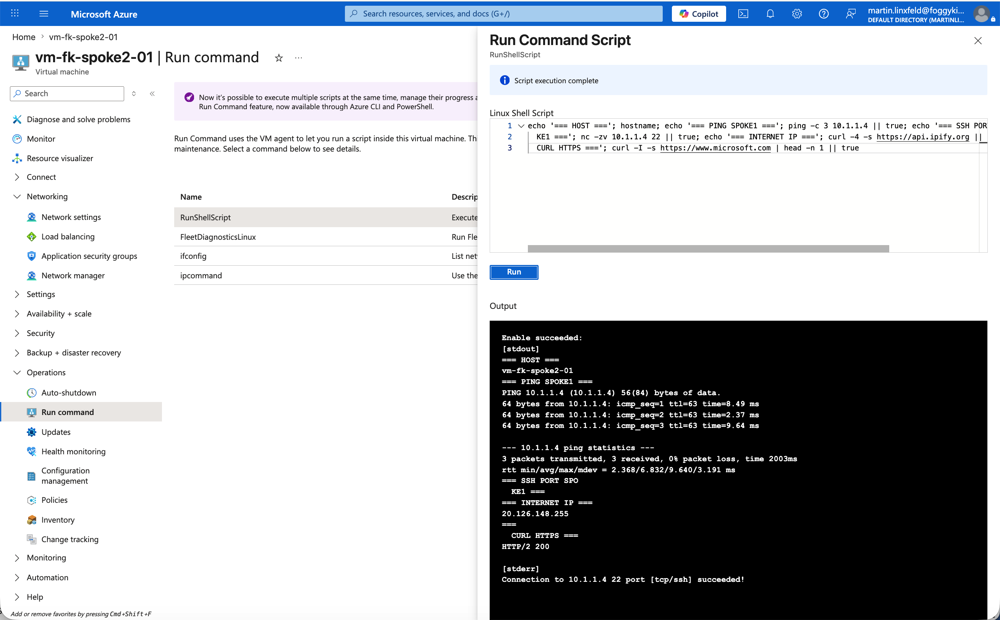

# Azure Firewall Transit Landing Zone

This example provides one payload for the shared **Azure firewall transit orchestrator pattern**.


---

## 🎯 Purpose

The goal of this example is to show a **hub-spoke transit and centralized egress pattern** built around Azure Firewall:

- east-west inspection between spokes
- centralized north-south egress
- UDR-based transit through the hub
- managed firewall instead of a router VM or NVA

---

## ✨ What the example does

This example composes:

- one resource group
- one hub VNet
- two spoke VNets
- one `AzureFirewallSubnet` in the hub
- hub-to-spoke peering
- one Azure Firewall with a standard public IP
- one route table per spoke with next hop set to the firewall private IP
- one private Linux VM in each spoke for validation traffic

---

## 📂 Pattern And Payload

The shared pattern lives in:

- [`patterns/azure/firewall_transit`](../../../../../patterns/azure/firewall_transit)

This example contributes:

- [`landing-zone.yaml`](landing-zone.yaml)
- a thin wrapper [`main.tf`](main.tf)
- provider configuration

The payload describes the transit-firewall intent, while the shared HCL pattern resolves the firewall, routes, peering, and validation workloads.

---

## 🚀 Deployment

OpenTofu:

```bash
tofu init
tofu plan
tofu apply
```

Terraform:

```bash
terraform init
terraform plan
terraform apply
```

If you want to inject your own public key instead of generating one automatically, pass:

```bash
tofu apply -var="admin_ssh_public_key=$(cat ~/.ssh/id_rsa.pub)"
```

---

## 📤 Expected Outputs

- resource group name
- hub and spoke VNet IDs
- firewall ID
- firewall private IP
- firewall public IP
- route table IDs
- spoke VM private IPs
- generated admin SSH private key PEM when `admin_ssh_public_key` is left empty

---

## ✅ Validation

This example was validated after `tofu apply` with Azure Run Command executed on both spoke VMs.

Observed results:

- `vm-fk-spoke1-01` reached `vm-fk-spoke2-01` successfully with `ping` to `10.2.1.4`
- `vm-fk-spoke2-01` reached `vm-fk-spoke1-01` successfully with `ping` to `10.1.1.4`
- TCP connectivity on port `22` succeeded in both directions with `nc -zv`
- both VMs reached the public Internet successfully with `curl https://www.microsoft.com`
- both VMs reported the same egress IP: `20.126.148.255`
- the observed egress IP matched the Azure Firewall public IP attached to `pip-fk-firewall-dev`

This confirms two key behaviors of the pattern:

- east-west spoke traffic is permitted through the centralized firewall
- default Internet egress is centralized through Azure Firewall rather than direct spoke outbound paths

Note: `traceroute` was not present in the default VM image during validation, so hop-by-hop path output was not captured in this run.

---

## 🖥️ Azure Portal View

The screenshots below capture the minimum control-plane and runtime evidence for the deployed firewall transit pattern.

They show the resource group inventory, Azure Firewall configuration and rules, route tables pointing both east-west and `0.0.0.0/0` to the firewall, and successful validation from both spoke VMs.

**Resource group overview**



**Azure Firewall overview**



**East-west network rule collection**



**East-west rule details**



**Route table for spoke1**



**Route table for spoke2**



**Validation from spoke1 VM**


**Validation from spoke2 VM**



**Application rule collection**



**Application rule details**



---

## 🧹 Cleanup

```bash
tofu destroy
```

---

## ⚠️ Known Limitations

- This example focuses on minimal transit-firewall behavior, not a full enterprise firewall policy.
- Firewall rule collections are intentionally simple and payload-driven.
- It complements the basic hub-spoke and private endpoint examples rather than replacing them.

---

## 🪪 License

Licensed under the **Universal Permissive License (UPL), Version 1.0**.  
See [LICENSE](../../../../../LICENSE) for details.

---

© 2026 FoggyKitchen.com — *Cloud. Code. Clarity.*
