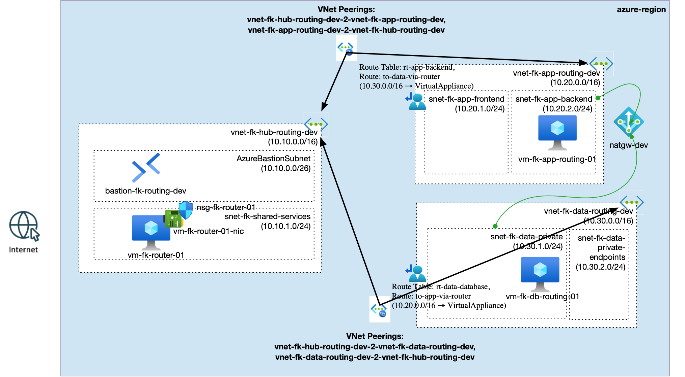

# Azure Hub-and-Spoke With Router VM Routing

This example provides one payload for the shared **Azure hub-and-spoke orchestrator pattern**.



---

## 🎯 Purpose

The goal of this example is to show a **hub-spoke transit routing pattern** built around a lightweight Linux router VM:

- hub-and-spoke networking
- hub-based spoke-to-spoke routing
- UDR-driven east-west transit
- Bastion-based operator access
- test workloads in both spokes

---

## ✨ What the example does

This example composes:

- one resource group
- one hub VNet
- one app spoke VNet
- one data spoke VNet
- hub-to-spoke peering with forwarded traffic enabled
- one router VM in `hub.shared`
- one NIC-level router NSG named `nsg-fk-router-01`
- one Linux VM in `app.backend`
- one Linux VM in `data.database`
- one route table on `app.backend`
- one route table on `data.database`
- NAT Gateway on selected private subnets
- Azure Bastion in the hub

The router VM has:

- Azure NIC IP forwarding enabled
- Linux IP forwarding enabled through cloud-init
- a static private IP used as the UDR next hop
- a dedicated NIC-level NSG allowing forwarded traffic from both spokes

---

## 📂 Pattern And Payload

The shared pattern lives in:

- [`patterns/azure/hub_spoke`](../../../../../patterns/azure/hub_spoke)

This example contributes:

- [`landing-zone.yaml`](landing-zone.yaml)
- a thin wrapper [`main.tf`](main.tf)
- provider configuration
- cloud-init scripts under [`scripts/`](scripts)

The payload describes explicit `routing.route_tables` entries and points them to the router VM through `next_hop_vm_ref`.

---

## 🧩 Module Map

- `terraform-az-fk-vnet` for hub and spoke VNets
- `terraform-az-fk-vnet-peering` for connectivity
- `terraform-az-fk-routing` for route tables and UDRs
- `terraform-az-fk-nsg` for subnet-level security boundaries
- `terraform-az-fk-public-ip` for NAT public identity
- `terraform-az-fk-natgw` for outbound egress
- `terraform-az-fk-bastion` for secure operator access
- `terraform-az-fk-compute` for the router VM and validation VMs

---

## 🚀 Deployment

OpenTofu:

```bash
tofu init
tofu plan
tofu apply
```

Terraform:

```bash
terraform init
terraform plan
terraform apply
```

If you want to inject your own public key instead of generating one automatically, pass:

```bash
tofu apply -var="admin_ssh_public_key=$(cat ~/.ssh/id_rsa.pub)"
```

---

## 📤 Expected Outputs

- resource group name
- hub and spoke VNet IDs
- subnet IDs
- Bastion name
- route table IDs
- VM private IPs for `hubrouter`, `app01`, and `db01`
- generated admin SSH private key PEM when `admin_ssh_public_key` is left empty

---

## 🧪 Validation

After deployment, validate spoke-to-spoke transit from either VM:

```bash
ping -c 4 10.30.1.4
traceroute 10.30.1.4
```

Expected behavior:

- `app01` reaches `db01` through the router VM in `hub.shared`
- the reverse direction works the same way

---

## 🧹 Cleanup

```bash
tofu destroy
```

---

## ⚠️ Known Limitations

- This example uses a lightweight router VM, not Azure Firewall.
- UDRs are attached only to the workload subnets participating in east-west transit.
- Private DNS and private endpoints are addressed separately by the `private_endpoint` pattern.

---

## 🪪 License

Licensed under the **Universal Permissive License (UPL), Version 1.0**.  
See [LICENSE](../../../../../LICENSE) for details.

---

© 2026 FoggyKitchen.com — *Cloud. Code. Clarity.*
