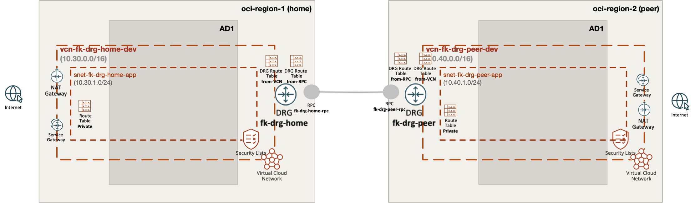

# OCI DRG Cross-Region Landing Zone

This example provides one payload for the shared **OCI DRG cross-region remote peering orchestrator pattern**.



---

## 🎯 Purpose

The goal of this example is to show an **OCI-native cross-region connectivity pattern** for:

- one VCN in a home region
- one VCN in a peer region
- one DRG per region
- one RPC per region
- explicit VCN-side and DRG-side routing for remote traffic

---

## ✨ What the example does

This example composes:

- one VCN, one subnet, and one DRG in the home region
- one VCN, one subnet, and one DRG in the peer region
- one RPC on each DRG
- one VCN attachment per DRG
- DRG route tables for traffic entering from the VCN and from the RPC
- private route tables in both VCNs that send cross-region traffic to the local DRG

---

## 📂 Pattern And Payload

The shared pattern lives in:

- [`patterns/oci/drg_cross_region`](../../../../../patterns/oci/drg_cross_region)

This example contributes:

- [`landing-zone.yaml`](landing-zone.yaml)
- [`terraform.tfvars.example`](terraform.tfvars.example)
- a thin wrapper [`main.tf`](main.tf)
- provider configuration with home and peer OCI regions

---

## 🚀 Deployment

OpenTofu:

```bash
cp terraform.tfvars.example terraform.tfvars
tofu init
tofu plan
tofu apply
```

Before applying, make sure:

- both `home_region` and `peer_region` are subscribed in your OCI tenancy
- the chosen compartment is available in both regions
- your OCI IAM policies allow DRG, RPC, VCN, subnet, and route table management in both regions

`terraform.tfvars` carries the OCI user-level provider credentials:

- `user_ocid`
- `fingerprint`
- `private_key_path`

`landing-zone.yaml` still carries the tenancy scope and regional architecture intent, including:

- `cloud.home_region`
- `cloud.peer_region`
- `cloud.tenancy_ocid`
- `cloud.compartment_ocid`
- the home and peer VCN, DRG, RPC, and route table topology

---

## 📤 Expected Outputs

- both VCN IDs
- both DRG IDs
- both DRG attachment ID maps
- both DRG route table ID maps
- both RPC ID maps

---

## 🖼️ Diagrams

This example includes a high-level architecture diagram for the home-region and peer-region DRG remote peering layout.

---

## 🧹 Cleanup

```bash
tofu destroy
```

---

## ⚠️ Known Limitations

- This example is connectivity-first and does not yet add compute workloads.
- It focuses on DRG and RPC routing, not on higher-level service composition.

---

## 🪪 License

Licensed under the **Universal Permissive License (UPL), Version 1.0**.  
See [LICENSE](../../../../../LICENSE) for details.

---

© 2026 FoggyKitchen.com — *Cloud. Code. Clarity.*
